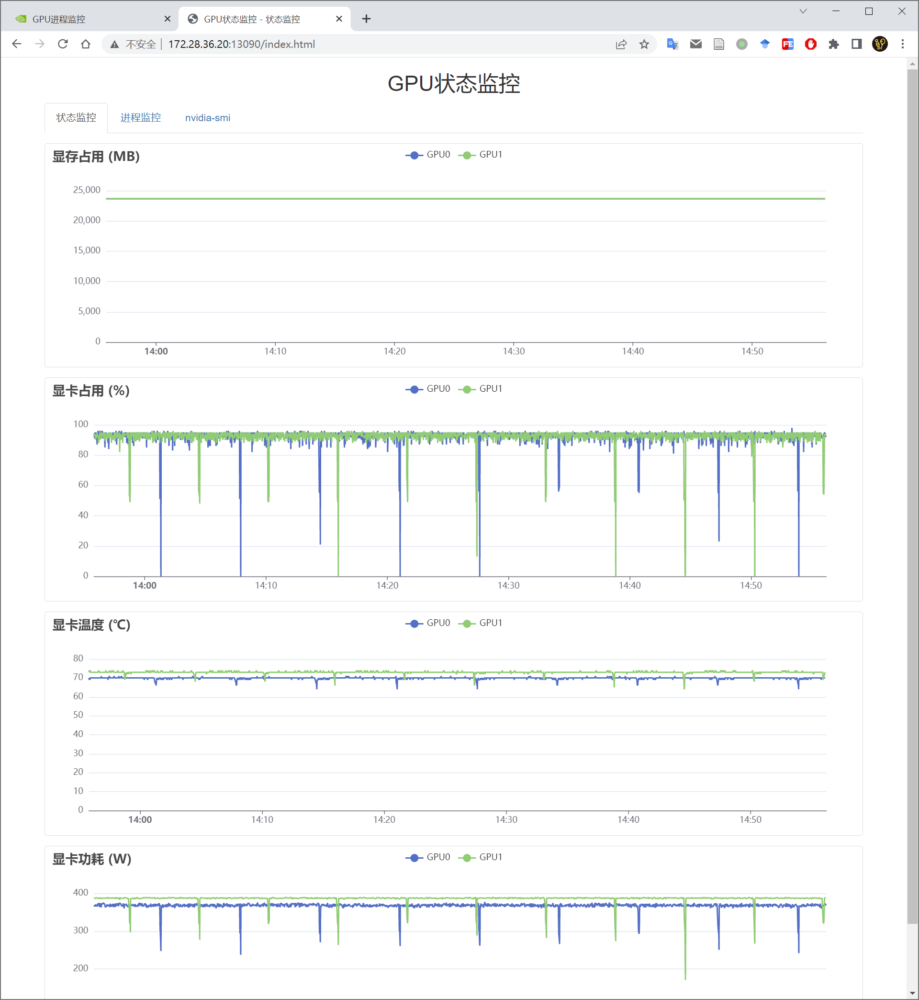
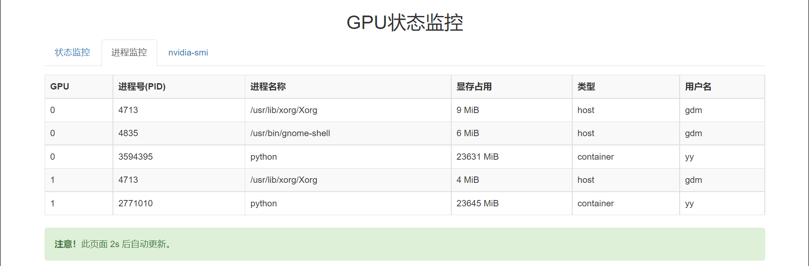
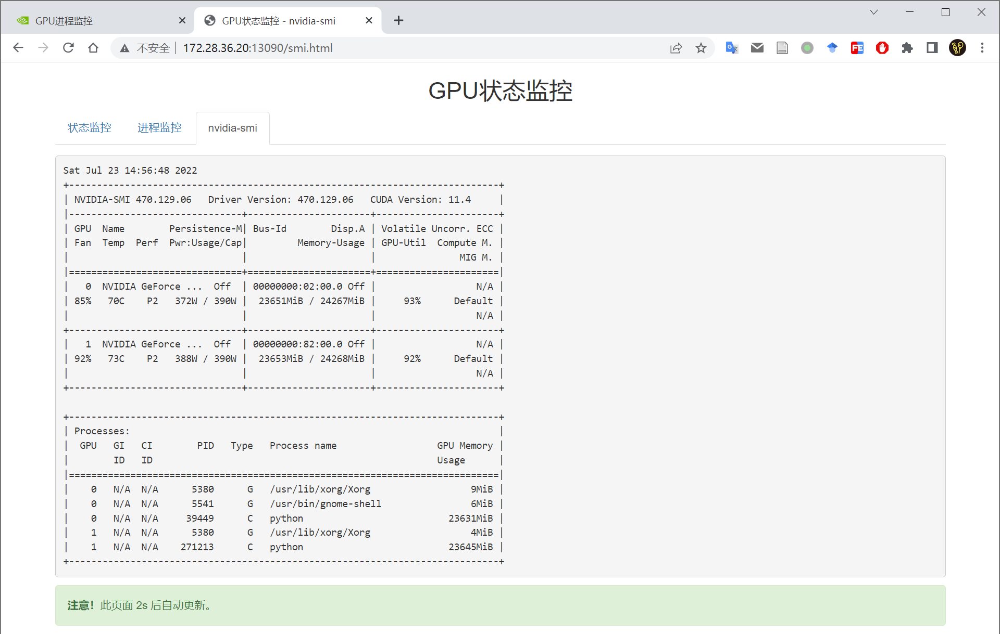

# GPU 状态监控器

## 简介
通过浏览器实时查看 GPU 的工作状态，包括显存占用、显卡占用、显卡温度、显卡功耗、进程信息等。具有以下特性

- 前后端分离，页面实时刷新
- 后端采用多线程缓存数据
- 进程监控和 Docker 结合，显示进程所属的容器名称
- 状态监控缓存过去一小时的数据

## 快速开始
```bash
# 克隆本仓库
git clone https://github.com/WangHaoCS/gpu-monitor.git
cd gpu-monitor
# 创建虚拟环境并安装依赖
python3 -m venv .venv
source .venv/bin/activate
pip install -r requirements.txt
# 启动服务
python gm.py --port 3090
```

## 效果展示
### 显卡状态监控

### 显卡进程监控

### nvidia-smi
